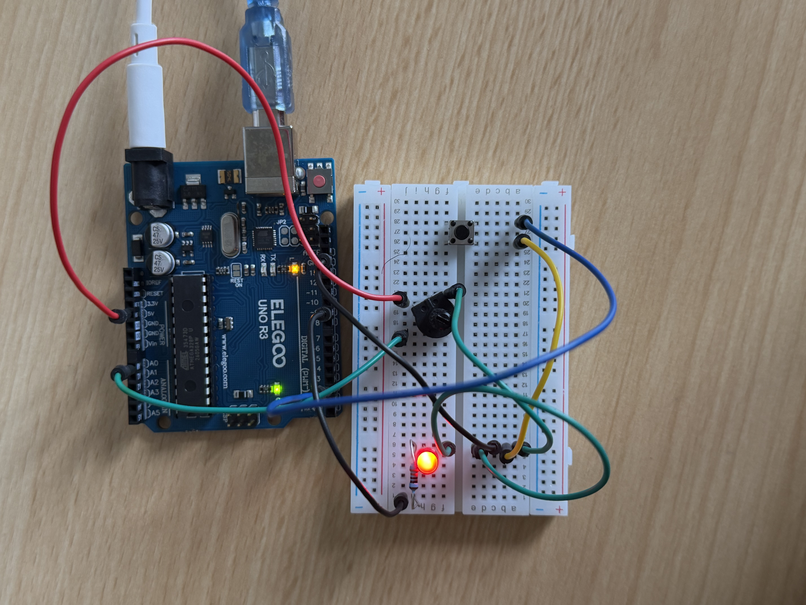

# Button and Potentiometer LED Control

This Arduino project combines a push button, potentiometer, and LED.

## Components

- Arduino UNO R3
- Push Button
- Potentiometer
- LED
- 220Ω Resistor
- Breadboard
- Jumper Wires

## Wiring

### Button
- One side → Digital Pin 2
- Other side → GND

### Potentiometer
- Outer pin → 5V
- Middle pin → A0
- Other outer pin → GND

### LED
- PWM Pin 9 → 220Ω resistor → LED
- Other LED leg → GND

## Behavior

- Press button once → LED ON
- Press again → LED OFF
- While ON, potentiometer controls LED brightness

## Concepts Learned

- Digital input
- Analog input
- PWM output
- `digitalRead()`
- `analogRead()`
- `analogWrite()`
- `map()`
- Boolean state control

## Circuit

