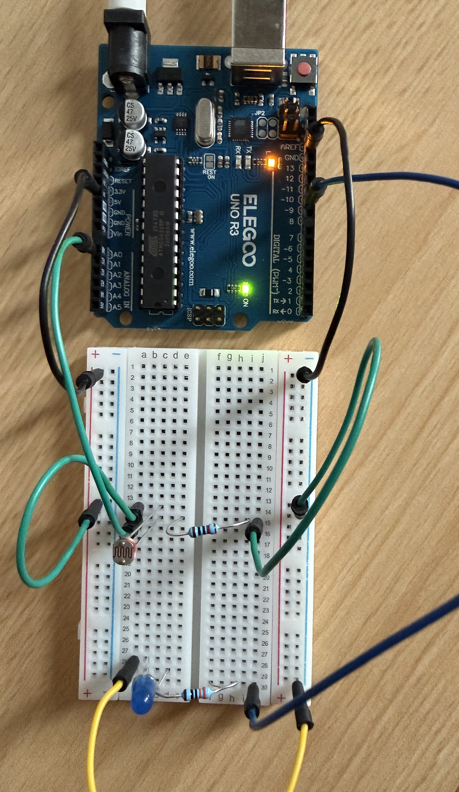

# Automatic Night Light

A simple Arduino project that automatically turns an LED on when the environment becomes dark.

## Circuit

## Components

- Arduino UNO
- LDR / Photoresistor
- LED
- 220Ω resistor
- 10kΩ resistor
- Breadboard
- Jumper wires

## Connections

### LDR
- LDR → 5V
- LDR output → A0
- 10kΩ resistor → GND

### LED
- Pin 9 → 220Ω resistor → LED
- LED → GND

## How It Works

The LDR measures the light level and Arduino reads the value using `analogRead()`.

The measured values range from 0 to 1023.

In this project, the threshold was set to:

`400`

If the light value is below 400, the LED turns on.

If the light value is above 400, the LED turns off.

## What I Learned

- Using an LDR sensor
- Using `analogRead()`
- Using a voltage divider
- Using `if / else`
- Setting a light threshold
- Controlling an LED automatically

## Circuit

