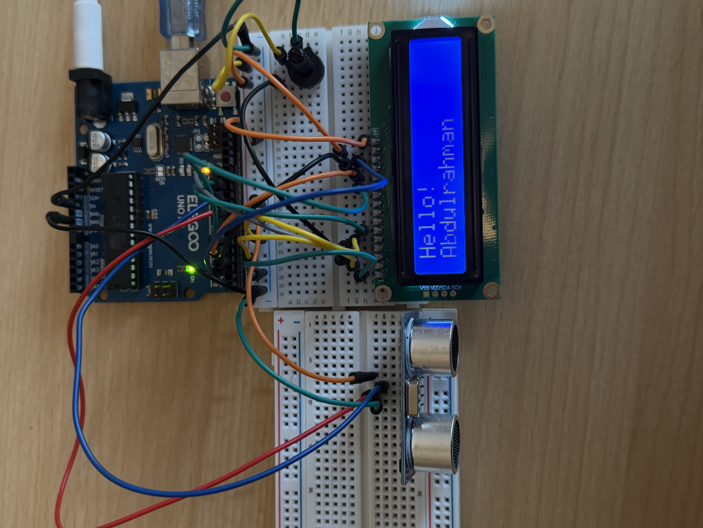

# LCD Distance Monitor

## Overview

This project uses an Arduino UNO, an HC-SR04 ultrasonic sensor, and a 16x2 LCD display to measure and display distance in real time.

When the system starts, the LCD displays a short welcome message. After two seconds, the system begins measuring the distance of nearby objects and displays the result in centimeters.

## Components

- Arduino UNO
- HC-SR04 Ultrasonic Sensor
- 16x2 LCD Display
- Potentiometer
- Breadboard
- Jumper Wires

## How It Works

The HC-SR04 ultrasonic sensor sends an ultrasonic pulse and measures how long it takes for the signal to return.

The Arduino calculates the distance using:

`Distance = Duration × 0.034 / 2`

The calculated distance is then displayed on the LCD screen.

## LCD Connections

| LCD Pin | Arduino |
|---|---|
| VSS | GND |
| VDD | 5V |
| VO | Potentiometer |
| RS | Pin 12 |
| RW | GND |
| E | Pin 11 |
| D4 | Pin 5 |
| D5 | Pin 4 |
| D6 | Pin 3 |
| D7 | Pin 2 |
| A | 5V |
| K | GND |

## HC-SR04 Connections

| HC-SR04 | Arduino |
|---|---|
| VCC | 5V |
| GND | GND |
| TRIG | Pin 8 |
| ECHO | Pin 9 |

## Features

- Startup welcome message
- Real-time distance measurement
- Distance displayed in centimeters
- LCD user interface
- Ultrasonic sensor integration

## What I Learned

In this project, I learned how to:

- Use a 16x2 LCD display with Arduino
- Use the LiquidCrystal library
- Display text and variables on an LCD
- Use `lcd.setCursor()` and `lcd.print()`
- Use the LCD in 4-bit mode
- Combine an ultrasonic sensor with a display
- Debug wiring problems
- Build a simple input-processing-output embedded system

## System Flow

HC-SR04 Sensor → Arduino UNO → Distance Calculation → LCD Display

## Project Status

Completed successfully.
