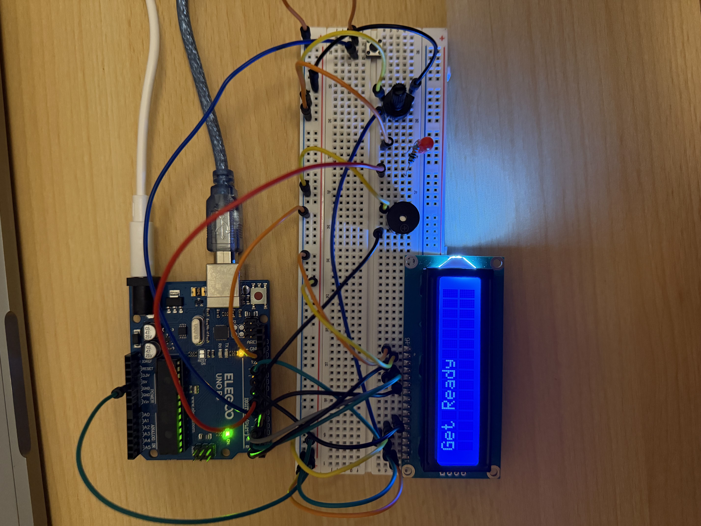

# Reaction Time Game

A simple Arduino reaction time game using an LCD, push button, LED, and buzzer.

## Components
- Arduino UNO
- 16x2 LCD
- Push Button
- LED
- 220Ω Resistor
- Buzzer
- Potentiometer
- Breadboard
- Jumper Wires

## How It Works
1. The LCD displays `Get Ready`.
2. The Arduino waits for a random time between 2 and 5 seconds.
3. The LCD displays `PRESS!`.
4. The LED turns on and the buzzer makes a sound.
5. The player presses the button.
6. The Arduino calculates the reaction time in milliseconds.
7. The result is displayed on the LCD.

## What I Learned
- Using `millis()` to measure time.
- Using `random()` to create a random delay.
- Reading a push button with `INPUT_PULLUP`.
- Controlling an LED and buzzer.
- Displaying information on a 16x2 LCD.
- Using a `while` loop to wait for user input.

## Demo

A short video showing the reaction time game in action.

[Watch the demo video](reaction-time-game.mp4)
